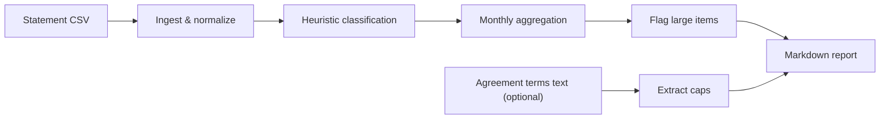
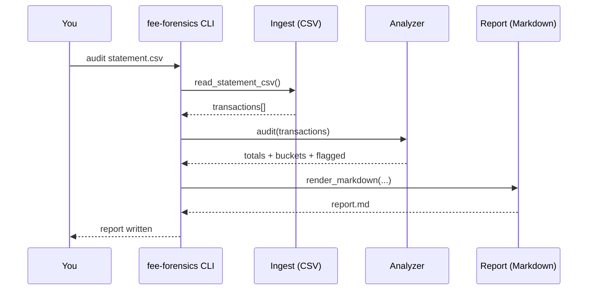
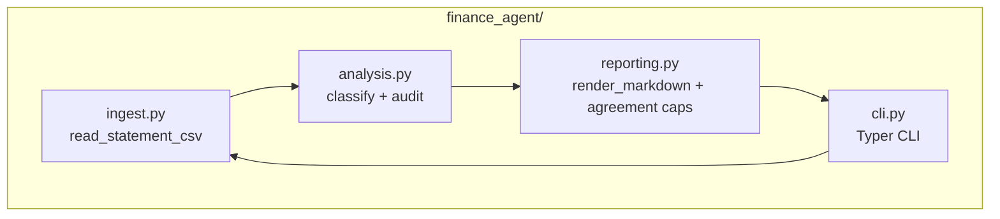

<p align="center">
  
</p>

<p align="center">
  <a href="https://github.com/ArttuAn/fee-forensics-agent/actions"></a>
  
  
  
  
</p>

## What this agent does

**Fee Forensics** is a finance agent that audits bank statements to surface **hidden fees**, **recurring charges**, and **interest/penalty-like debits**, then generates a **negotiation-ready** report.

### Input → model → output (simple mental model)

- **Input**: a bank statement export (CSV) with `date`, `description`, `amount`
- **Model**: the Fee Forensics analyzer (rules + aggregation; optional LangChain workflow for “explain”)
- **Output**: a Markdown report with totals and breakdowns

In the simplest example, the key outputs are:

```text
Fees: 155.75 | Interest: 60.92 | Debits: 1,027.22
```

#### Comprehensive example (input → model → output)

**1) Input (CSV snippet)**

```csv
date,description,amount
2026-01-02,MONTHLY MAINTENANCE FEE,-15.00
2026-01-07,INCOMING WIRE FEE,-25.00
2026-01-10,INTEREST CHARGE,-42.17
2026-01-05,ACH CREDIT PAYROLL,2500.00
```

**2) Model (run the analyzer)**

```bash
fee-forensics audit sample-data\statement.csv --agreement sample-data\agreement.txt --out reports\sample-report.md
```

**3) Output (report excerpt)**

```markdown
## Executive summary

- **Total credits**: 2,500.00
- **Total debits**: 1,027.22
- **Estimated bank fees**: 155.75
- **Estimated interest/penalties**: 60.92
```

### Why it’s different

Most expense trackers tell you *where money went*. This agent focuses on *what the bank charged you*, why it’s recurring, and what you can take back to the bank (waiver review, tier review, fee schedule confirmation).

### Pipeline (MVP)



### How it works (sequence)



### Components



## Install

Requires **Python 3.10+**.

```bash
python -m venv .venv
.\.venv\Scripts\activate
pip install -e .
```

## Quickstart

Use the included sample statement:

```bash
fee-forensics audit sample-data\statement.csv --out reports\sample-report.md
```

Open the report:

```bash
notepad reports\sample-report.md
```

With agreement text:

```bash
fee-forensics audit sample-data\statement.csv --agreement sample-data\agreement.txt --out reports\report.md
```

## Practical examples (in-repo)

- **Examples folder**: see `examples/README.md`
- **Sample output**: `examples/output/sample-report.md`
- **PowerShell runner**: `examples/run_examples.ps1`

## LangChain + LangSmith (explain workflow)

Fee Forensics uses **LangChain** for an optional workflow that turns a generated report into:

- a **negotiation email** to your bank
- a **questions checklist** for the call

### Install LLM extras

```bash
pip install -e ".[llm]"
```

### Enable LangSmith tracing (optional)

Set environment variables:

```powershell
$env:LANGCHAIN_TRACING_V2="true"
$env:LANGCHAIN_API_KEY="YOUR_LANGSMITH_KEY"
$env:LANGCHAIN_PROJECT="fee-forensics"
```

Notes:
- Some setups use `LANGSMITH_TRACING="true"` instead. Either works for most environments.

### Generate negotiation pack from a report

```bash
fee-forensics explain reports\sample-report.md --out-dir reports\explain --provider openai --model gpt-4o-mini
```

## What the report looks like (preview)

You’ll get:

- **Executive summary** totals (credits, debits, estimated fees, estimated interest/penalties)
- **Monthly breakdown** table (fees vs interest vs other debits)
- **Flagged** high-impact fee/interest items
- **Most common** descriptions (helps spot recurring line-items)

Example section:

```text
Fees: 155.75 | Interest: 60.92 | Debits: 1,027.22
```

## CSV format

Minimum columns (case-insensitive; extra columns ok):

- `date` (or `transaction_date`)
- `description` (or `memo`)
- `amount` (positive = credit, negative = debit)

## Notes / roadmap

- Add PDF statement ingestion
- Add “what to ask the bank” suggestion pack
- Add optional LLM enrichment (fully local/offline or API-backed)
