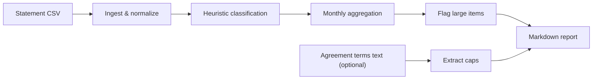
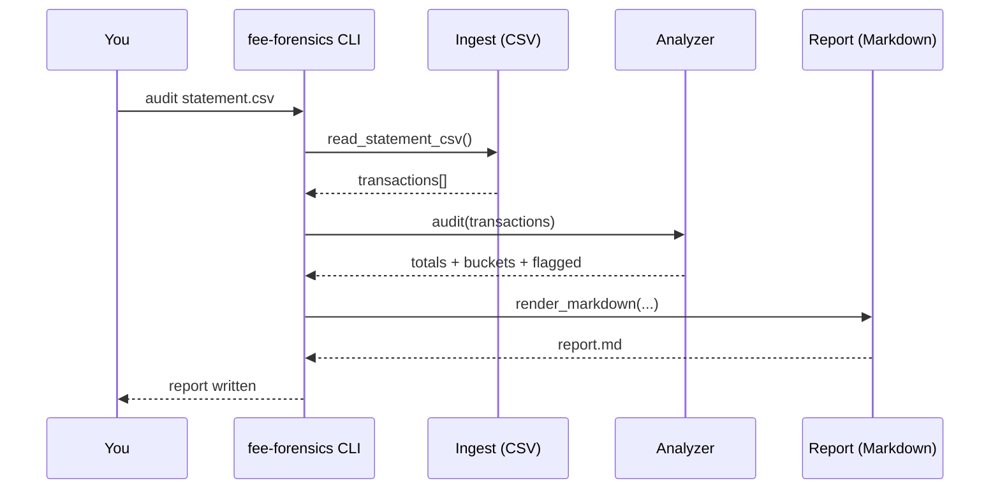
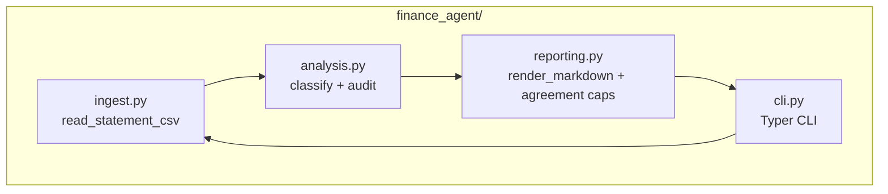

<p align="center">
  
</p>

<p align="center">
  <a href="https://github.com/ArttuAn/fee-forensics-agent/actions/workflows/ci.yml"></a>
  <a href="https://github.com/ArttuAn/fee-forensics-agent/blob/main/LICENSE"></a>
  
  
  
  
  
  
  
  
  
  
</p>

## What this agent does

**Fee Forensics** is a finance agent that audits bank statements to surface **hidden fees**, **recurring charges**, and **interest/penalty-like debits**, then generates a **negotiation-ready** report.

<p align="center">
  
</p>

### Input → model → output (simple mental model)

- **Input**: a bank statement export (CSV) with `date`, `description`, `amount`
- **Model**: the Fee Forensics analyzer (rules + aggregation; optional LangChain workflow for “explain”)
- **Output**: a Markdown report with totals and breakdowns

In the simplest example, the key outputs are:

```text
Fees: 155.75 | Interest: 60.92 | Debits: 1,027.22
```

#### Comprehensive example (input → model → output)

**1) Input (CSV snippet)**

```csv
date,description,amount
2026-01-02,MONTHLY MAINTENANCE FEE,-15.00
2026-01-07,INCOMING WIRE FEE,-25.00
2026-01-10,INTEREST CHARGE,-42.17
2026-01-05,ACH CREDIT PAYROLL,2500.00
```

**2) Model (run the analyzer)**

```bash
fee-forensics audit sample-data\statement.csv --agreement sample-data\agreement.txt --out reports\sample-report.md
```

**3) Output (report excerpt)**

```markdown
## Executive summary

- **Total credits**: 2,500.00
- **Total debits**: 1,027.22
- **Estimated bank fees**: 155.75
- **Estimated interest/penalties**: 60.92
```

### Why it’s different

Most expense trackers tell you *where money went*. This agent focuses on *what the bank charged you*, why it’s recurring, and what you can take back to the bank (waiver review, tier review, fee schedule confirmation).

### Pipeline (MVP)



### How it works (sequence)



### Components



## Install

Requires **Python 3.10+**.

### Using pip (recommended)

```bash
pip install fee-forensics-agent
```

### From source

```bash
git clone https://github.com/ArttuAn/fee-forensics-agent.git
cd fee-forensics-agent
python -m venv .venv
.\.venv\Scripts\activate  # Windows
source .venv/bin/activate  # Linux/Mac
pip install -e .
```

### Development installation

```bash
pip install -e ".[dev]"
pre-commit install
```

### Using Makefile (Linux/Mac)

```bash
make install-dev
```

### Using Docker

Build the Docker image:

```bash
docker build -t fee-forensics .
```

Run the demo with Docker:

```bash
docker run --rm -v $(pwd)/sample-data:/app/sample-data -v $(pwd)/reports:/app/reports fee-forensics
```

Use docker-compose for easier development:

```bash
# Run the demo
docker-compose up app

# Start development container with shell access
docker-compose run dev /bin/bash
```

## Configuration

Fee Forensics supports configuration via YAML files or environment variables.

### YAML Configuration

Create a `fee-forensics.yaml` file in your project directory:

```yaml
# Audit thresholds
flag_threshold_abs: 25.0  # Absolute threshold for flagging transactions
flag_threshold_pct: 0.05   # Percentage threshold for flagging

# Output settings
output_dir: reports        # Default output directory for reports

# Logging settings
log_level: INFO            # DEBUG, INFO, WARNING, ERROR
log_file: null             # Optional log file path (null for console only)
```

### Environment Variables

You can also configure using environment variables:

```bash
export FF_FLAG_THRESHOLD_ABS=25.0
export FF_FLAG_THRESHOLD_PCT=0.05
export FF_OUTPUT_DIR=reports
export FF_LOG_LEVEL=INFO
export FF_LOG_FILE=audit.log
```

### Programmatic Configuration

```python
from finance_agent.config import Config, get_config

# Load from file
config = Config.from_yaml(Path("fee-forensics.yaml"))

# Load from environment
config = Config.from_env()

# Use defaults
config = get_config()
```

## Quickstart

Use the included sample statement:

```bash
fee-forensics audit sample-data\statement.csv --out reports\sample-report.md
```

Or run the bundled demo (statement + agreement):

```bash
fee-forensics demo
```

Open the report:

```bash
notepad reports\sample-report.md
```

With agreement text:

```bash
fee-forensics audit sample-data\statement.csv --agreement sample-data\agreement.txt --out reports\report.md
```

## Practical examples (in-repo)

- **Examples folder**: see `examples/README.md`
- **Sample output**: `examples/output/sample-report.md`
- **PowerShell runner**: `examples/run_examples.ps1`

## Workflow Automation

For batch processing multiple statements, use the workflow automation script:

### Single File Audit

```bash
python examples/workflow_automation.py single sample-data/statement.csv --output reports
```

### Batch Processing

```bash
python examples/workflow_automation.py batch sample-data/ --output reports
```

### With Configuration

```bash
python examples/workflow_automation.py single sample-data/statement.csv --config fee-forensics.yaml
```

### With Agreement

```bash
python examples/workflow_automation.py single sample-data/statement.csv --agreement sample-data/agreement.txt
```

The automation script generates both Markdown and JSON reports for each statement.

## LangChain + LangSmith (explain workflow)

Fee Forensics uses **LangChain** for an optional workflow that turns a generated report into:

- a **negotiation email** to your bank
- a **questions checklist** for the call

### Install LLM extras

LangChain/LangSmith are optional — core audit works without them:

```bash
pip install -e ".[llm]"
```

### Enable LangSmith tracing (optional)

Set environment variables:

```powershell
$env:LANGCHAIN_TRACING_V2="true"
$env:LANGCHAIN_API_KEY="YOUR_LANGSMITH_KEY"
$env:LANGCHAIN_PROJECT="fee-forensics"
```

Notes:
- Some setups use `LANGSMITH_TRACING="true"` instead. Either works for most environments.

### Generate negotiation pack from a report

```bash
fee-forensics explain reports\sample-report.md --out-dir reports\explain --provider openai --model gpt-4o-mini
```

## What the report looks like (preview)

You’ll get:

- **Executive summary** totals (credits, debits, estimated fees, estimated interest/penalties)
- **Monthly breakdown** table (fees vs interest vs other debits)
- **Flagged** high-impact fee/interest items
- **Most common** descriptions (helps spot recurring line-items)

Example section:

```text
Fees: 155.75 | Interest: 60.92 | Debits: 1,027.22
```

## CSV format

Minimum columns (case-insensitive; extra columns ok):

- `date` (or `transaction_date`, `posting_date`)
- `description` (or `memo`, `details`, `narrative`)
- `amount` (positive = credit, negative = debit)

Alternatively, use separate **debit** and **credit** columns (`debit`/`credit`, `withdrawal`/`deposit`, etc.).

### JSON export (automation)

```bash
fee-forensics audit sample-data\statement.csv --out reports\report.md --json-out reports\report.json
```

## Development

### Available Makefile commands

```bash
make help           # Show all available commands
make install        # Install the package
make install-dev    # Install with development dependencies
make test           # Run tests
make test-cov       # Run tests with coverage report
make lint           # Run linting checks
make format         # Format code
make clean          # Clean build artifacts
make demo           # Run the demo
make pre-commit-install  # Install pre-commit hooks
make pre-commit-run      # Run pre-commit hooks
make check          # Run all checks (lint + test)
```

### Running tests

```bash
pytest
```

With coverage:
```bash
pytest --cov=finance_agent --cov-report=term-missing
```

### Code quality

```bash
ruff check .        # Lint
ruff format .       # Format
```

## Notes / roadmap

- Add PDF statement ingestion
- Add "what to ask the bank" suggestion pack
- Add optional LLM enrichment (fully local/offline or API-backed)
